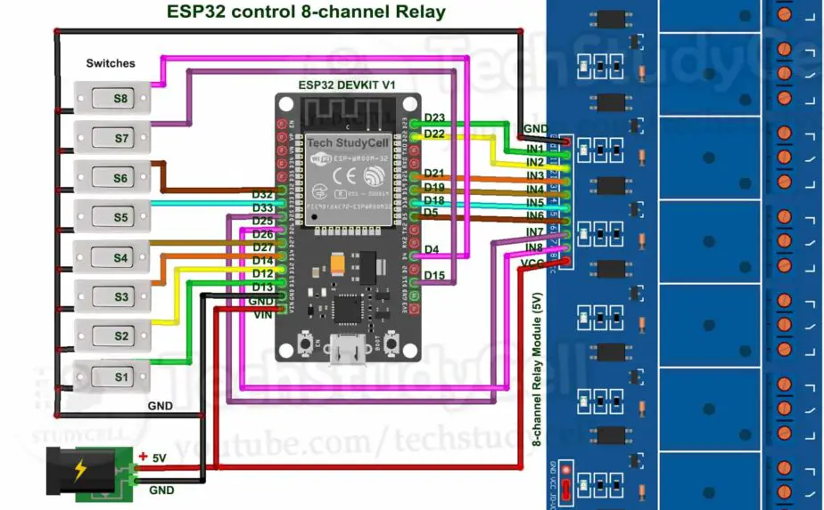

# Domótica la automatización del hogar
 
Hola y bienvenidos a este tutorial,

## Bienvenido a este tutorial

Aquí veremos como automatizar nuestra casa a partir de la placa de desarrollo ESP32. Para ello utilizaremos simplemente unos relés que nos permiten apagar y encender nuestras luces. Podremos encenderlas tanto físicamente a partir de unos interruptores como a través de nuestro teléfono móvil. Utilizaremos una simple página web y una base de datos (en este caso SUPABASE). Finalmente subiremos nuestra página web a GITHUB y así poder encender y apagar las luces a través de un navegador (computadora, tablet o teléfono móvil).

## Materiales

Necesitaremos:

1. Una placa de desarrollo ESP32

2. Un placa con relés

3. Interruptores

4. Cables dupont, hembra -> hembra

5. Alimentador de 5 voltios

6. Una Shield (escudo) para facilitar las conexiones - OPCIONAL